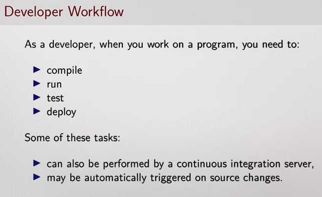
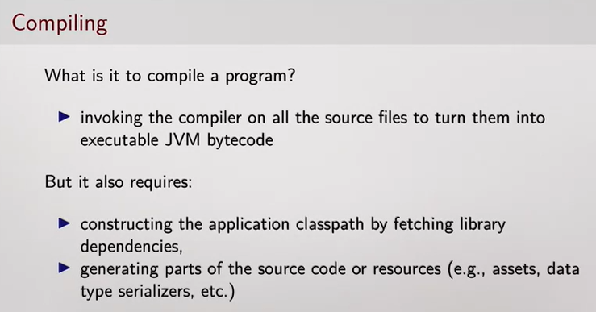
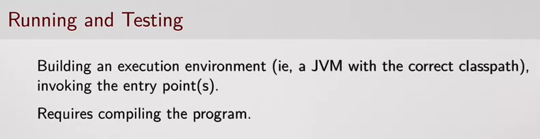
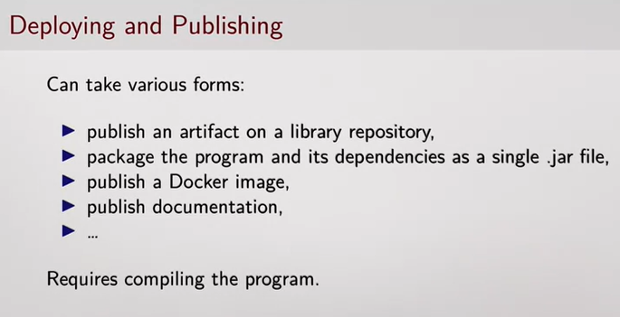
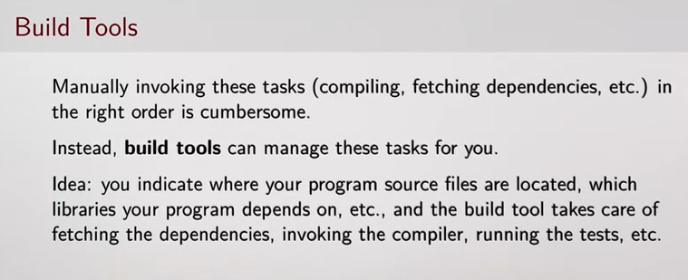
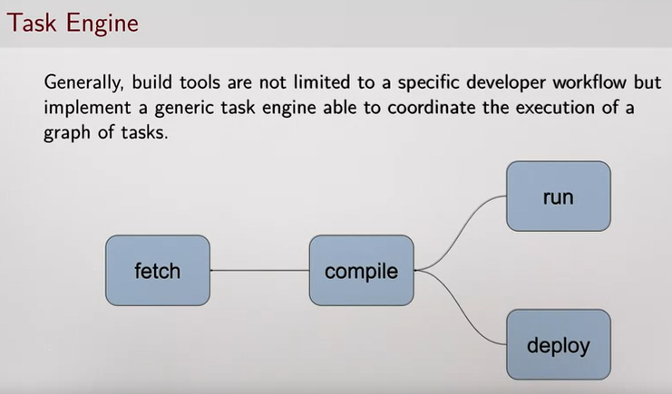
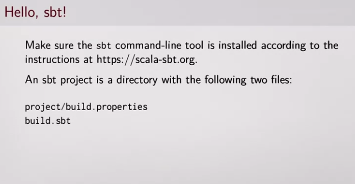
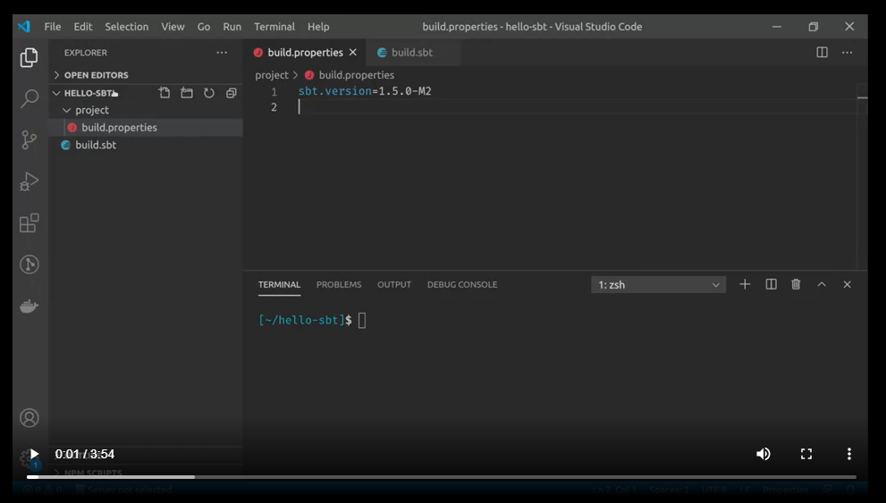
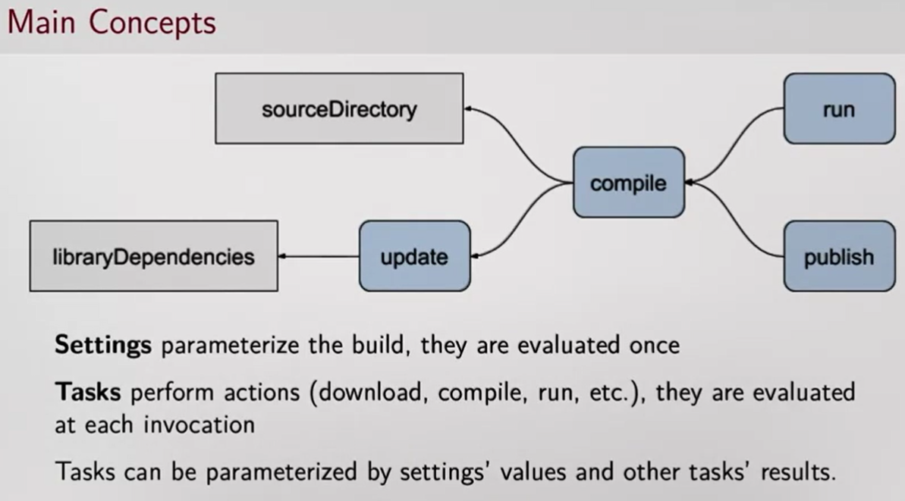
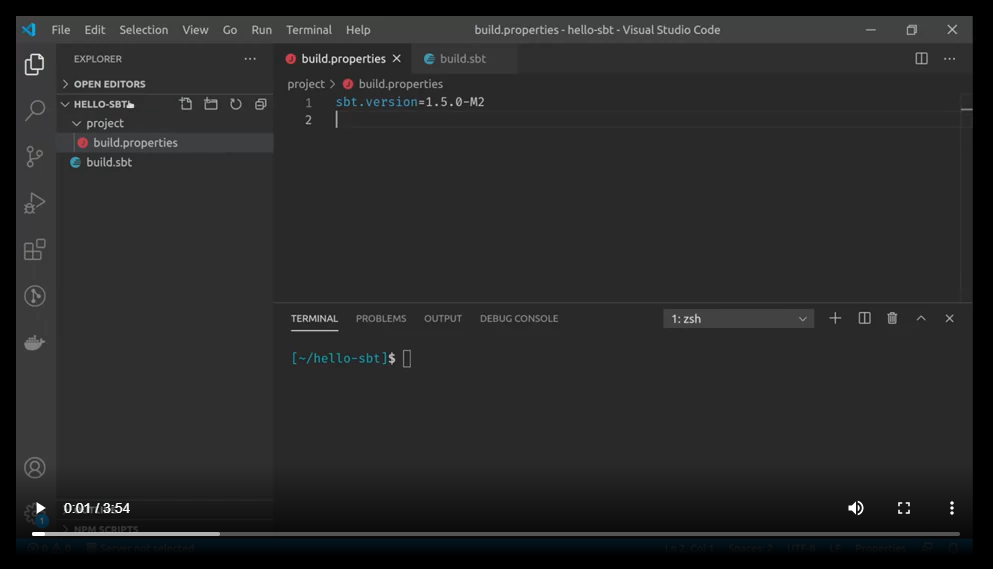

# sbt - The interactive build tool

This is an introduction to [sbt](https://www.scala-sbt.org/), which is a common build tool for Scala projects. While
sbt is a very popular build tool for Scala, there are several other build tools which support Scala:

* [Maven](https://maven.apache.org/index.html)
* [Gradle](https://gradle.org/)
* [Mill](https://github.com/com-lihaoyi/mill),

and so on. Before we get started, what exactly is a build tool?

## What is a build tool?
A "Build tool" is a catch-all term that refers to anything that is needed to get a piece of software set up,
but isn't needed after that.

### Developer Workflow
Let's begin with an overview of how build tools manage your workflow.  As a developer, when you work on the program,
you need to perform various tasks, such as compiling the sources, running the program, running the tests or deploying
the program. And some of these tasks may also be performed by a continuous integration server or maybe automatically
triggered on source changes. So we want a way to automate these tasks.  A build tool provides that automation. 

### Compiling
What is it to compile a Scala program? It consists of invoking the Scala compiler on all the source files to turn them into 
executable JVM bytecode.  But first it requires constructing the class pass of the application by resolving and 
fetching all its library dependencies. And possibly it may also require generating parts of the source code or 
resources like assets, data types and serializers.

### Running
Running the program or, its test, consists of building an execution environment, ( e.g. a JVM with the correct
classpath) and invoking the program entry point. But first it requires compiling the program.  So in terms of a build
tool we say the run task, depends on the compilation task.

### Deploying and Publishing
Deploying or publishing a program can take various forms. It can consist of publishing an artifact to a library
repository or packaging the program, and it's dependencies into a single jar file and so on. But first it requires
compiling the program

### Build Tools
Manually invoking all these tasks, compiling fetching dependencies, etc. and in the right holder is cumbersome.
Instead, build tools can manage this task for you. The idea is that you indicate to the build tool where your source
files are located. Which library of program depends on etc. And the build tool takes care of fetching the dependencies,
invoking the compiler, running the test, etc.

### Build Tools as a Task Engine
Generally build tools are not limited to a specific developer workflow, but they implement a generic task engine able
to coordinate the execution of a graph of tasks like this one (below). We have a task run, which depends on a task 
compile, which depends on fetch. To summarize. Working on a program involves performing values interdependent tasks
such as compiling, running and deploying the program. Build tools aim at simplifying the coordination of this task.

## Creating a sbt project
Now that we know, in general, what a build tool is let us move on to discussing SBT, which is our build tool of
choice for Scala projects.  Let's get started with our first SBT project using both SBT and IntelliJ. 

### Install sbt and make en empty project
Before you start, make sure the sbt command-line tool is installed according to the
[instructions]((./Installation.md)). Also Java, and IntelliJ!

### First Project
Ok to make an sbt project you need a directory with the following two files, _build.properties_,
located in a subdirectory called _project_, and a top-level filed called _build.sbt_.

Recap:

This video will walk you through making a simple sbt project.

 
### Main Sbt concepts

In the previous video we saw how to invoke the tasks compile and run. Now in the diagram below , I want to illustrate the
fact that the _task_ run depends on the _task compile_. So if I invoke run without first invoking compile, sbt
automatically invokes compile first. Let's introduce a few other tasks. For instance, compile depends on _update_, which
resolves the library dependencies of the project. This task depends on a setting, named _libraryDependencies_. By
changing the value of this setting, you change the libraries that are added to your project.

So there are two main concepts in sbt, _settings_ and _tasks_. Settings parameterize the build, and they are evaluated
only once, when sbt loads the project. And tasks perform actions such as downloading the dependencies or running the
program. They are evaluated each time you invoke them. So each time you invoke the task run, it runs your program.

Tasks can be parameterized by settings' values, and by other tasks' results. For instance, the setting
libraryDependencies defines the libraries that your project depends on. And the task update downloads these dependencies
when you invoke the task. 

### Adding new dependencies to your project

Speaking of libraryDependencies, let's see how to use a library for colorizing the text we print to the console.

First, we need to declare the dependency in the build definition by appending the so-called coordinates of the library to the libraryDependencies key. So to find the coordinates of the library, I'm going to use the Scala Index. The library I want to use is named Fansi. So I just search it here, and then here, I can see it's latest version and its coordinates. So the coordinates are an organization name. Here it's com.library, and artifact name, Fansi, and a revision number, 0.2.10. I just copy the coordinates in my build definition. After I change the build definition, I need to reload the build definition to reload sbt. If I run a command like run, sbt prints a warning, because it detects that the build definition has changed. So let's reload sbt and use the library. I want to print the greeting message in red. So to achieve this, I need to call fansi.Color.Red(greeting), like this. Now if I invoke run, sbt first downloads the dependencies, then it compiles the project, and finally it runs the program, which prints this message in red. It is worth noting that the build definition itself is written in Scala. So these values here are just Scala strings, and here we apply the operator := to the value ScalaVersion. So every line here is a Scala expression which is evaluated by sbt. When it loads the build definition. Keep in mind that there are some differences between a regular Scala program and an sbt build definition. In particular, sbt files automatically import sbt keys, such as libraryDependencies and scalaVersion. Since this is just Scala code, if I want to add several library dependencies, I will just build a list of dependencies, just a Scala list. Good, now, how do we run the tests of a project? In this video, we will use a test framework named munit. First, we declare a dependency on the text framework itself. So let's look for munit,

Play video starting at :9:56 and follow transcript9:56
And I'm interested in this line, Which I add here, and we explicitly mention that this library, munit, should be part of the class path for running the tests, but not for running the main program. And I do that by adding the trailing % Test here. Then we tell sbt that we will use this library as a test framework, which I do with this line. And next week, we will see a little bit more about how to use munit. So this is not a video about how to use munit, but more about how to use sbt. By default, sbt looks for test sources in the src/test/scala directory. So let's add a test to our program.
Play video starting at :11:5 and follow transcript11:05
So this is a dummy test just for the example. To run the task, we invoke the test task from the sbt prompt, so here, test. sbt compiles a program, and then compiles the test, and runs the test. Here I get a test report that reports a failure. And we will show a little bit more how to use munit next week. We have seen that sbt provides predefined tasks and settings out of the box, such as compile, run, and test. Additional tasks or predefined configurations can be provided by plugins.
Play video starting at :12:1 and follow transcript12:01
So let's see how you would use an sbt plugin in your project. Plugins are dependencies to the build definition itself, not to the program. So they are declared in the file project/plugins.sbt, instead of build.sbt. As an example, let's our plugin that configures the compile reporter to present the errors in a different way. In the Scala Index, we browse sbt plugins, and search for a plugin about compilation errors. Here it is, this plugin customizes the way compilation errors are reported. I can copy-paste this line of code to add to my build definition.
Play video starting at :13:5 and follow transcript13:05
So here I defined the file project/plugins.sbt, and I just paste the line of code I got from Scala Index, and I use this version here. So that's all we need to do for this plugin, then it is automatically enabled when the build definition is loaded by sbt. So I will just reload sbt, and now if I compile something that contains an error, so let's create an error. Now the output is a little bit different than the default output.
Play video starting at :13:53 and follow transcript13:53
Another example of plugin is sbt-site. This plugin defines new tasks and settings, to make it easier to build a website. It is often used to build a documentation website for libraries. Again, we add the dependency to the plugin in the file project/plugins.sbt. Then we use the plugin in the build definition, so in the file build.sbt. And this plugin defines a task makeSite, which I can configure to create, for instance, a website with just a single file, index.html. So if I reload my sbt, and then if I invoke the task makeSite, I can see that the plugin generates the website here in the target directory.
Play video starting at :15:4 and follow transcript15:04
That's all for this introduction to the sbt build tool. In summary, sbt is an interactive build tool. This means that you start the sbt shell in the morning, and then you manage your project from there. The build definition is written in Scala. A build definition essentially assignments values to setting keys such as ScalaVersion or libraryDependencies.
Hello, in this video, you will learn how to use sbt, which is a common build tool for Scala projects. sbt is a build tool commonly used in Scala. For instance, the assignments of this course are sbt projects. For your information, there are other build tools that support Scala, like Maven, Gradle, Mill, and so on. Let's create an sbt project. Before you start, make sure the sbt command-line tool is installed according to the instructions on the sbt website. An sbt project is a directory with the following two files, build.properties, located in a subdirectory project, and build.sbt. So here is my code editor with an sbt project, an empty sbt project with the file build.properties, and the file build.sbt. The file build.properties defines the version of sbt we want to use. Here, I'm using this milestone release, but you should use stable release. It's just that at the time we record this video, the support for Scala 3 is only available in this milestone release. And the file build.sbt defines the configuration of the project. For now, we just indicate the version of Scala that we want to use, 3.0.0-RC1, which is the latest version of Scala at the time this video was recorded. In the terminal, invoke the command sbt from the project root directory, which is the directory that contains the file build.sbt. So what happens is that the sbt launcher downloads the required version of sbt if necessary, as specified in the file build.properties. And it also downloads the required version of the Scala compiler, if necessary, according to the project configuration. And finally, the launcher starts the sbt shell, which lets you invoke sbt task. So here I'm the sbt shell, and I can invoke tasks to compile or run the project. By default, sbt compiles source files that are in the directory src/main/scala. So let's define a project in the package hello-sbt. In the sbt shell, we can invoke the compile task to compile the program source files. And we see, sbt's compiling the project. The output of the compilation is cached in a directory target. Play video starting at :3:10 and follow transcript3:10 Oops, not this one, but this one. I can see the classifiers. Play video starting at :3:19 and follow transcript3:19 If I try to recompile, it immediately finishes, because it has already compiled the source code. Now if I change the content of the source file, and I try to recompile, then sbt detects that the sources have changed, and it recompiles the project. When your project contains multiple Scala files, if you modify only one file, sbt will try to recompile only this file and the files that depend on it, but not more. This is called incremental computation. All right, next the task run compiles and then runs the program. Another useful task is the task console, which compiles the program and then opens a REPL, which is an interactive prompt to evaluate expressions in your program. So here I can evaluate Scala expression, Play video starting at :4:29 and follow transcript4:29 Like 1 + 1, but I can refer to the definitions of my program. So I can use the value greeting defined in the package hello-sbt. Play video starting at :4:47 and follow transcript4:47 For instance, I can call the method toUpperCase on it, good. I've just shown how to invoke the tasks compile and run. And in this diagram, I want to illustrate the fact that the task run depends on the task compile. So if I invoke run without first invoking compile, sbt automatically invokes compile first. I also show a few other tasks. For instance, compile depends on update, which reserves the library dependencies of the project. This task depend on a setting, libraryDependencies. By changing the value of this setting, you change the libraries that are added to your project. So there are two main concepts in sbt, settings and tasks. Settings parameterize the build, and they are evaluated only once, when sbt loads the project. And tasks perform actions such as downloading the dependencies or running the program. They are evaluated each time you invoke them. So each time you invoke the task run, it runs your program. Tasks can be parameterized by settings' values, and by other tasks' results. For instance, the setting libraryDependencies defines the libraries that your project depends on. And the task update downloads these dependencies when you invoke the task. Speaking of libraryDependencies, let's see how to use a library for colorizing the text we print to the console. First, we need to declare the dependency in the build definition by appending the so-called coordinates of the library to the libraryDependencies key. So to find the coordinates of the library, I'm going to use the Scala Index. The library I want to use is named Fansi. So I just search it here, and then here, I can see it's latest version and its coordinates. So the coordinates are an organization name. Here it's com.library, and artifact name, Fansi, and a revision number, 0.2.10. I just copy the coordinates in my build definition. After I change the build definition, I need to reload the build definition to reload sbt. If I run a command like run, sbt prints a warning, because it detects that the build definition has changed. So let's reload sbt and use the library. I want to print the greeting message in red. So to achieve this, I need to call fansi.Color.Red(greeting), like this. Now if I invoke run, sbt first downloads the dependencies, then it compiles the project, and finally it runs the program, which prints this message in red. It is worth noting that the build definition itself is written in Scala. So these values here are just Scala strings, and here we apply the operator := to the value ScalaVersion. So every line here is a Scala expression which is evaluated by sbt. When it loads the build definition. Keep in mind that there are some differences between a regular Scala program and an sbt build definition. In particular, sbt files automatically import sbt keys, such as libraryDependencies and scalaVersion. Since this is just Scala code, if I want to add several library dependencies, I will just build a list of dependencies, just a Scala list. Good, now, how do we run the tests of a project? In this video, we will use a test framework named munit. First, we declare a dependency on the text framework itself. So let's look for munit, Play video starting at :9:56 and follow transcript9:56 And I'm interested in this line, Which I add here, and we explicitly mention that this library, munit, should be part of the class path for running the tests, but not for running the main program. And I do that by adding the trailing % Test here. Then we tell sbt that we will use this library as a test framework, which I do with this line. And next week, we will see a little bit more about how to use munit. So this is not a video about how to use munit, but more about how to use sbt. By default, sbt looks for test sources in the src/test/scala directory. So let's add a test to our program. Play video starting at :11:5 and follow transcript11:05 So this is a dummy test just for the example. To run the task, we invoke the test task from the sbt prompt, so here, test. sbt compiles a program, and then compiles the test, and runs the test. Here I get a test report that reports a failure. And we will show a little bit more how to use munit next week. We have seen that sbt provides predefined tasks and settings out of the box, such as compile, run, and test. Additional tasks or predefined configurations can be provided by plugins. Play video starting at :12:1 and follow transcript12:01 So let's see how you would use an sbt plugin in your project. Plugins are dependencies to the build definition itself, not to the program. So they are declared in the file project/plugins.sbt, instead of build.sbt. As an example, let's our plugin that configures the compile reporter to present the errors in a different way. In the Scala Index, we browse sbt plugins, and search for a plugin about compilation errors. Here it is, this plugin customizes the way compilation errors are reported. I can copy-paste this line of code to add to my build definition. Play video starting at :13:5 and follow transcript13:05 So here I defined the file project/plugins.sbt, and I just paste the line of code I got from Scala Index, and I use this version here. So that's all we need to do for this plugin, then it is automatically enabled when the build definition is loaded by sbt. So I will just reload sbt, and now if I compile something that contains an error, so let's create an error. Now the output is a little bit different than the default output. Play video starting at :13:53 and follow transcript13:53 Another example of plugin is sbt-site. This plugin defines new tasks and settings, to make it easier to build a website. It is often used to build a documentation website for libraries. Again, we add the dependency to the plugin in the file project/plugins.sbt. Then we use the plugin in the build definition, so in the file build.sbt. And this plugin defines a task makeSite, which I can configure to create, for instance, a website with just a single file, index.html. So if I reload my sbt, and then if I invoke the task makeSite, I can see that the plugin generates the website here in the target directory. Play video starting at :15:4 and follow transcript15:04 That's all for this introduction to the sbt build tool. In summary, sbt is an interactive build tool. This means that you start the sbt shell in the morning, and then you manage your project from there. The build definition is written in Scala. A build definition essentially assignments values to setting keys such as ScalaVersion or libraryDependencies.: Added to Selection. Press [CTRL + S] to save as a note
