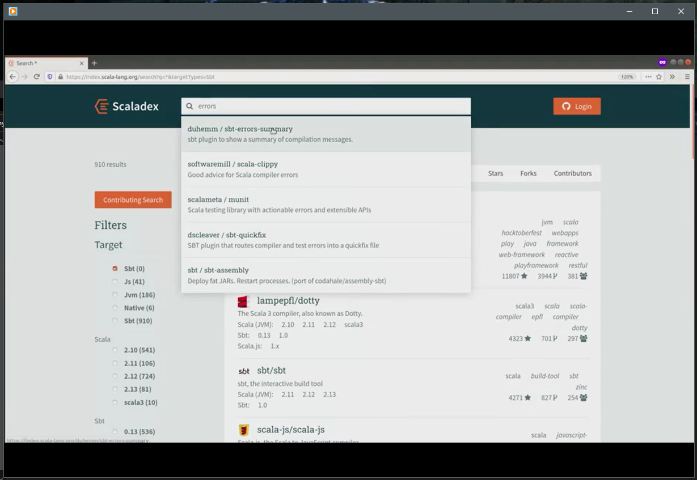

# sbt - The interactive build tool

This is an introduction to [sbt](https://www.scala-sbt.org/), which is a common build tool for Scala projects. While
sbt is a very popular build tool for Scala, there are several other build tools which support Scala:

* [Maven](https://maven.apache.org/index.html)
* [Gradle](https://gradle.org/)
* [Mill](https://github.com/com-lihaoyi/mill),

and so on. Before we get started, what exactly is a build tool?

## What is a build tool?
A "Build tool" is a catch-all term that refers to anything that is needed to get a piece of software set up,
but isn't needed after that.

### Developer Workflow
Let's begin with an overview of how build tools manage your workflow.  As a developer, when you work on the program,
you need to perform various tasks, such as compiling the sources, running the program, running the tests or deploying
the program. And some of these tasks may also be performed by a continuous integration server or maybe automatically
triggered on source changes. So we want a way to automate these tasks.  A build tool provides that automation. 

### Compiling
What is it to compile a Scala program? It consists of invoking the Scala compiler on all the source files to turn them into 
executable JVM bytecode.  But first it requires constructing the class pass of the application by resolving and 
fetching all its library dependencies. And possibly it may also require generating parts of the source code or 
resources like assets, data types and serializers.

### Running
Running the program or, its test, consists of building an execution environment, ( e.g. a JVM with the correct
classpath) and invoking the program entry point. But first it requires compiling the program.  So in terms of a build
tool we say the run task, depends on the compilation task.

### Deploying and Publishing
Deploying or publishing a program can take various forms. It can consist of publishing an artifact to a library
repository or packaging the program, and it's dependencies into a single jar file and so on. But first it requires
compiling the program

### Build Tools
Manually invoking all these tasks, compiling fetching dependencies, etc. and in the right holder is cumbersome.
Instead, build tools can manage this task for you. The idea is that you indicate to the build tool where your source
files are located. Which library of program depends on etc. And the build tool takes care of fetching the dependencies,
invoking the compiler, running the test, etc.

### Build Tools as a Task Engine
Generally build tools are not limited to a specific developer workflow, but they implement a generic task engine able
to coordinate the execution of a graph of tasks like this one (below). We have a task run, which depends on a task 
compile, which depends on fetch. To summarize. Working on a program involves performing values interdependent tasks
such as compiling, running and deploying the program. Build tools aim at simplifying the coordination of this task.

## Creating a sbt project
Now that we know, in general, what a build tool is let us move on to discussing SBT, which is our build tool of
choice for Scala projects.  Let's get started with our first SBT project using both SBT and IntelliJ. 

### Install sbt and make en empty project
Before you start, make sure the sbt command-line tool is installed according to the
[instructions]((./Installation.md)). Also Java, and IntelliJ!

### First Project
Ok to make an sbt project you need a directory with the following two files, _build.properties_,
located in a subdirectory called _project_, and a top-level filed called _build.sbt_.

Recap:

This video will walk you through making a simple sbt project.

 
### Main Sbt concepts: settings and tasks

In the previous video we saw how to invoke the tasks _compile_ and _run_. In the diagram below, I 
want to illustrate the fact that the task _run_ depends on the task _compile_. So if I invoke run
without first invoking compile, sbt automatically invokes compile first.

Let's introduce a few other tasks. For instance, _compile_ depends on _update_, which resolves the
library dependencies of the project. This task depends on a setting, named _libraryDependencies_.
By changing the value of this setting, you change the libraries that are added to your project.

So there are two main concepts in sbt, _settings_ and _tasks_. Settings parameterize the build, and
they are evaluated only once, when sbt loads the project. And tasks perform actions such as
downloading the dependencies or running the program. They are evaluated each time you invoke them.
So each time you invoke the task run, it runs your program.

Tasks can be parameterized by settings' values, and by other tasks' results. For instance, the
setting libraryDependencies defines the libraries that your project depends on. And the task update
downloads these dependencies when you invoke the task. 

### Adding new dependencies to your project

As ab example of adding library dependencies, let's see how to add a library, called 
_fansi_ for colorizing the text we print to the console, to your project.  Then we'll see how to add
a unit test library _munit_ to our project. 

### sbt plugins

Let's see how you would use an sbt plugin in your project. Plugins are dependencies to the build
definition itself, not to the program. They are declared in the file project/plugins.sbt, instead
of build.sbt.

As an example, let's install plugin that configures the compiler's reporter to present the errors
in a different way.

## In summary
sbt is an interactive build tool you terminal, and then you manage your project from there. The
build definition is written in Scala. A build definition essentially assignments values to setting
keys such as ScalaVersion or libraryDependencies.

