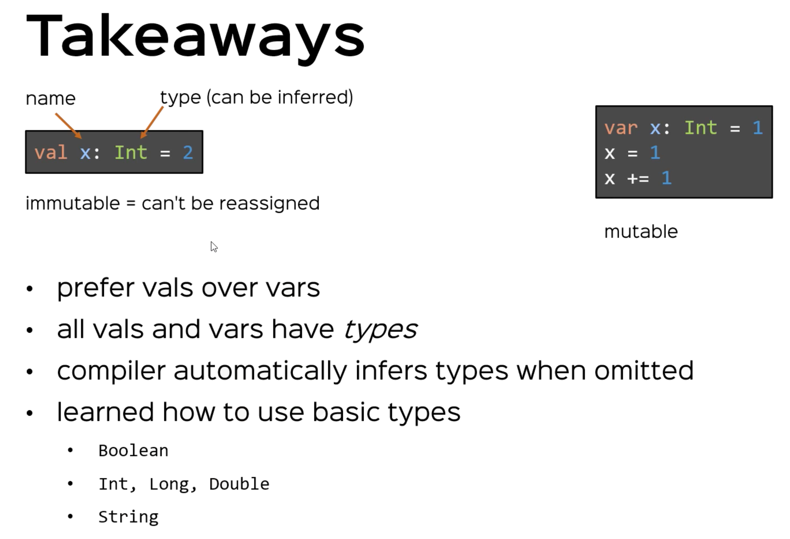

# Literals, Values, Variables, and Types

* A _literal_ (or literal data) is data that appears directly in the source code, e.g. the number ```42```, the character ``` 'B'```, and the text ```"Hello, World"```, or the function ```(a:String, b:String) => a + a```
* A _function literal_ (or anonymous function) Is function with no name in source code, specified with the function literal syntax.  e.g. ```(x:Int) => x```
* A _value_ is an immutable, typed storage unit. A value can be assigned data when it is defined, but can never be reassigned.  ```val x = 1```
* A _variable_ is a mutable, typed storage unit.  A variable can be assigned data when it is defined and can be reassigned data at any time.  ```var a = 1```
* A _type_ is the kind of data you are working with, a definition or classification of data.  All data in Scala corresponds to a specific type, and all Scala types are defined as classes with methods that operate on the data.  ```var x:Int = 1``` Here Int is the type.

```scala
  val x: Int = 42
  println(x)
  // x = 2 throws a reassignment to val error.  vals are immutable

  val x2 = 42
  // specifying the type is optional.  The compiler figures out the type from type inference
  // val x3: String = 42 won't

  //some types

  val aBoolean: Boolean = true
  val aChar: Char = 'x'
  val anInt: Int = x
  val aShort: Short = 1;   // Short.MaxValue is the biggest short
  val aLong: Long = 1000L  // use the L to tell the compiler you want a Long not an Int
  val aDouble: Double = 2.0
  val aFloat: Float = 2.0f // use the f to tell the compiler you want a Float not a Double

  // variables
  var aVariable: Int = 5

  aVariable = 6 // here we are able to reassign data to a variable via a side-effect

```



# Expressions

An _Expression_ is any bit of code that yields a result.  You can also say that an expression `evaluates to` a result or `results in` a value. Compare this to a an _Instruction_ or a _Statement_

* Instructions/Statements do not return results and are executed solely for their side effects
* Expressions always return a result and often have no side effects at all.

```scala
  val x = 1 + 2  // 1 + 2 is an Expression.  This expression is evaluated to the value 3 and has type Int
                 // It is then assigned to the val x
  println(x)


  println( 2 + 3 * 4)
  // Some math operators + - * / & | ^ << >> >>> (right shift with zero extension)

  println( 1 == x)
  // Some boolean operators == != > >= < <=

  println(!(1 == x))
  // ! is the unary negation operator

  var aVariable = 2
  aVariable += 3 // also works with -=, *= /= ... side effects on variables

  // Instructions (DO something ) VS Expressions (VALUE and type)

  // Consider the IF expression
  val aCondition = true
  val aConditionedValue = if(aCondition) 5 else 3
  println("aConditionedValue: " + aConditionedValue)

  // Scala while has loops but often we don't need them
  var i = 0
  while(i < 10) {
    println(i)
    i += 1
  }

  println("fancy: " +( 1 to 10).mkString(","))

  // A while loops *is* an expression.  But it is an expression of type Unit, and there
  // action is done as a side effect

  // side effects: println(), whiles, reassigning to a var

  // code blocks
  val aCodeBlock = {
    val y = 2
    val z = y + 1

    if(z >2) "hello" else "goodbye"
  }

  // everything inside the { } is a code block.  It is also an expression, it value is the value of
  // the final expression in the code block.
```


# Functions

A _Function_ can be _invoked_ with a list of arguments to produce a result.  A function has a parameter list, a body, and a result type.  Functions that are members of a class, trait or singleton object, are called _methods_.  Functions defined inside other functions are called _local functions_.  Functions with the result type of `Unit` are called _procedures_.  Anonymous functions in source code are called _function literals_.   At run time, function literals are instantiated into objects called _function values_

