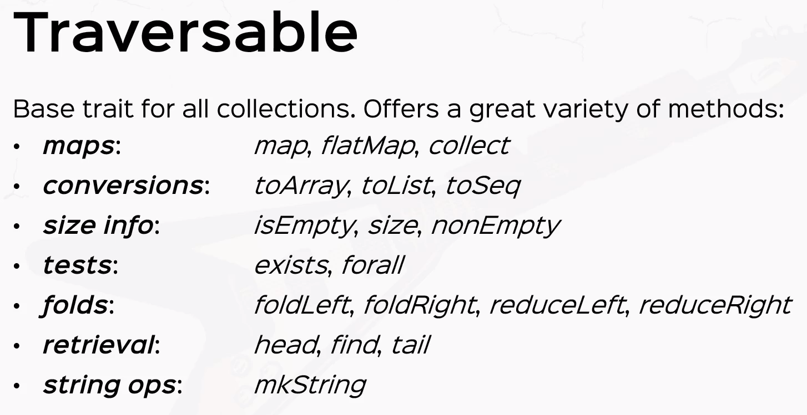

Scala defines several collection classes:

### Base Classes
- [`Iterable`](http://www.scala-lang.org/api/current/index.html#scala.collection.Iterable) (collections you can iterate on)
- [`Seq`](http://www.scala-lang.org/api/current/index.html#scala.collection.Seq) (ordered sequences)
- [`Set`](http://www.scala-lang.org/api/current/index.html#scala.collection.Set)
- [`Map`](http://www.scala-lang.org/api/current/index.html#scala.collection.Map) (lookup data structure)


### Immutable Collections


These are the major immutable classes we use.
- [`List`](http://www.scala-lang.org/api/current/index.html#scala.collection.immutable.List) (linked list, provides fast sequential access)
- [`Stream`](http://www.scala-lang.org/api/current/index.html#scala.collection.immutable.Stream) (same as List, except that the tail is evaluated only on demand)
- [`Vector`](http://www.scala-lang.org/api/current/index.html#scala.collection.immutable.Vector) (array-like type, implemented as tree of blocks, provides fast random access)
- [`Range`](http://www.scala-lang.org/api/current/index.html#scala.collection.immutable.Range) (ordered sequence of integers with equal spacing)
- [`String`](http://docs.oracle.com/javase/1.5.0/docs/api/java/lang/String.html) (Java type, implicitly converted to a character sequence, so you can treat every string like a `Seq[Char]`)
- [`Map`](http://www.scala-lang.org/api/current/index.html#scala.collection.immutable.Map) (collection that maps keys to values)
- [`Set`](http://www.scala-lang.org/api/current/index.html#scala.collection.immutable.Set) (collection without duplicate elements)

### Mutable Collections


Typically `Array` is the only mutable collection we use.~~~~~~~~
- [`Array`](http://www.scala-lang.org/api/current/index.html#scala.Array) (Scala arrays are native JVM arrays at runtime, therefore they are very performant)
- Scala also has mutable maps and sets; these should only be used if there are performance issues with immutable types

### Traversable
Most of the behavior we will use is described in the the top-level collections class `Traversable`



### Examples
<!-- code -->
```scala
    val fruitList = List("apples", "oranges", "pears")
    // Alternative syntax for lists
    val fruit = "apples" :: ("oranges" :: ("pears" :: Nil)) // parens optional, :: is right-associative
    fruit.head   // "apples"
    fruit.tail   // List("oranges", "pears")
    val empty = List()
    val empty = Nil

    val nums = Vector("louis", "frank", "hiromi")
    nums(1)                     // element at index 1, returns "frank", complexity O(log(n))
    nums.updated(2, "helena")   // new vector with a different string at index 2, complexity O(log(n))
    
    val fruitSet = Set("apple", "banana", "pear", "banana")
    fruitSet.size    // returns 3: there are no duplicates, only one banana

    val r: Range = 1 until 5 // 1, 2, 3, 4
    val s: Range = 1 to 5    // 1, 2, 3, 4, 5
    1 to 10 by 3  // 1, 4, 7, 10
    6 to 1 by -2  // 6, 4, 2

    val s = (1 to 6).toSet
    s map (_ + 2) // adds 2 to each element of the set

    val s = "Hello World"
    s filter (c => c.isUpper) // returns "HW"; strings can be treated as Seq[Char]

    // Operations on sequences
    val xs = List(...)
    xs.length   // number of elements, complexity O(n)
    xs.last     // last element (exception if xs is empty), complexity O(n)
    xs.init     // all elements of xs but the last (exception if xs is empty), complexity O(n)
    xs take n   // first n elements of xs
    xs drop n   // the rest of the collection after taking n elements
    xs(n)       // the nth element of xs, complexity O(n)
    xs ++ ys    // concatenation, complexity O(n)
    xs.reverse  // reverse the order, complexity O(n)
    xs updated(n, x)  // same list than xs, except at index n where it contains x, complexity O(n)
    xs indexOf x      // the index of the first element equal to x (-1 otherwise)
    xs contains x     // same as xs indexOf x >= 0
    xs filter p       // returns a list of the elements that satisfy the predicate p
    xs filterNot p    // filter with negated p 
    xs partition p    // same as (xs filter p, xs filterNot p)
    xs takeWhile p    // the longest prefix consisting of elements that satisfy p
    xs dropWhile p    // the remainder of the list after any leading element satisfying p have been removed
    xs span p         // same as (xs takeWhile p, xs dropWhile p)
    
    List(x1, ..., xn) reduceLeft op    // (...(x1 op x2) op x3) op ...) op xn
    List(x1, ..., xn).foldLeft(z)(op)  // (...( z op x1) op x2) op ...) op xn
    List(x1, ..., xn) reduceRight op   // x1 op (... (x{n-1} op xn) ...)
    List(x1, ..., xn).foldRight(z)(op) // x1 op (... (    xn op  z) ...)
    
    xs exists p    // true if there is at least one element for which predicate p is true
    xs forall p    // true if p(x) is true for all elements
    xs zip ys      // returns a list of pairs which groups elements with same index together
    xs unzip       // opposite of zip: returns a pair of two lists
    xs.flatMap f   // applies the function to all elements and concatenates the result
    xs.sum         // sum of elements of the numeric collection
    xs.product     // product of elements of the numeric collection
    xs.max         // maximum of collection
    xs.min         // minimum of collection
    xs.flatten     // flattens a collection of collection into a single-level collection
    xs groupBy f   // returns a map which points to a list of elements
    xs distinct    // sequence of distinct entries (removes duplicates)

    x +: xs  // creates a new collection with leading element x
    xs :+ x  // creates a new collection with trailing element x

    // Operations on maps
    val myMap = Map("I" -> 1, "V" -> 5, "X" -> 10)  // create a map
    myMap("I")      // => 1  
    myMap("A")      // => java.util.NoSuchElementException  
    myMap get "A"   // => None 
    myMap get "I"   // => Some(1)
    myMap.updated("V", 15)  // returns a new map where "V" maps to 15 (entry is updated)
                            // if the key ("V" here) does not exist, a new entry is added

    // Operations on Streams
    val xs = Stream(1, 2, 3)
    val xs = Stream.cons(1, Stream.cons(2, Stream.cons(3, Stream.empty))) // same as above
    (1 to 1000).toStream // => Stream(1, ?)
    x #:: xs // Same as Stream.cons(x, xs)
             // In the Stream's cons operator, the second parameter (the tail)
             // is defined as a "call by name" parameter.
             // Note that x::xs always produces a List
```