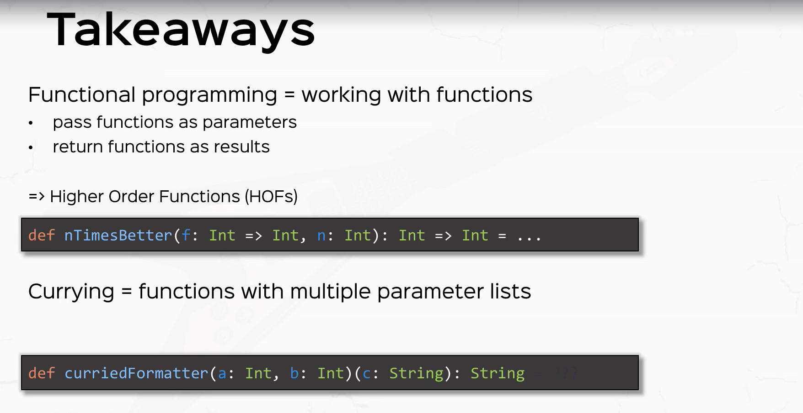
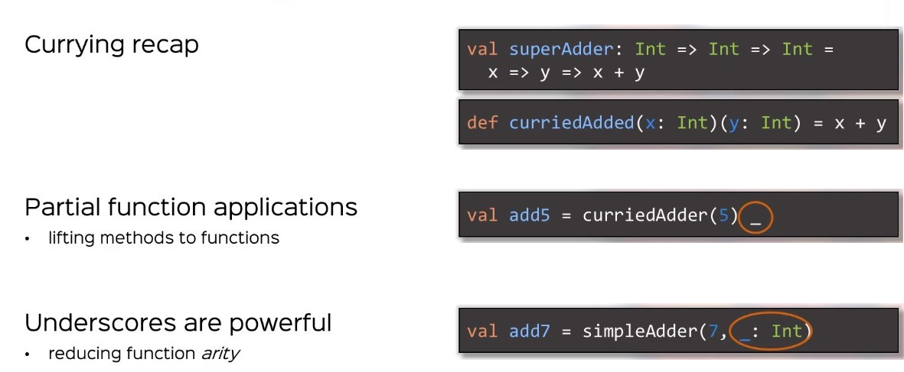

# What is currying

## Here is one definition:

Converting a function with multiple arguments into a function with a
single argument that returns another function.

Here is alternative definition:

The technique of translating the evalution of a function that takes mulitple arguments
into evaluating a sequence of functions each with a single argument.

Imagine replacing x = f(x1,x2,x3) with g(x1)(x2)(x3).

Where:
```text
h = g(x1) where h also is a function of 1 variable
i  = h(x2) again i is a function of 1 variable

so finally x = i(x3) = h(x2)(x3) = g(x1)(x2)(x3)
```

Example say f(x,y,z) = x+y+z
```text

f(x,y,z) at x=x1, y=y1, z=z1 IS  (x,y,z) => x + y + z evaluated at x=x1, y=y1, z=z1

= [(x) => [(y) = [(z) => z + y + x ] at z=z1 ] at y=y1]  at x=x1
= [(x) => [(y) = z1 + y + x] at y=y1]  at x=x1
= [(x) => z1 + y1 + x]  at x=x1
= z1 + y1 + x1

```

<!-- code -->
```scala
    def f(a: Int, b: Int): Int // uncurried version (type is (Int, Int) => Int)
    def f(a: Int)(b: Int): Int // curried version (type is Int => Int => Int)
```

##Currying in Scala

```scala

# Create a curried function from a regular function
  val adder = (x: Int, y: Int ) => x + y
  val curried_adder = adder.curried  // curried_adder: Int => (Int => Int)

  curried_adder(1)(2) = 3 
  curried_adder(1) = (x: Int) => x + 1 
```

```scala
# Create a curried function from method
  def adder(x: Int, y: Int ): Int  = x + y
  // (adder _) will do an ETA expansion to create a function literal

  val curried_adder = (adder _).curried  // curried_adder: Int => (Int => Int)

  curried_adder(1)(2) = 3 
  curried_adder(1) = (x: Int) => x + 1 

```





