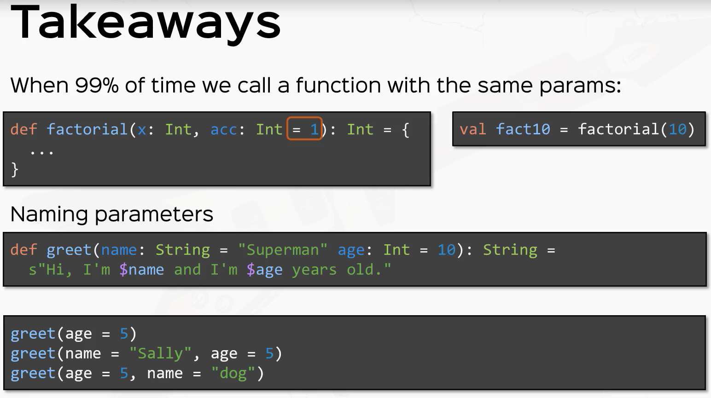

# Default Values and Named Arguments

## Calling Functions with Named Arguments:

The convention for calling functions is that the arguments are specified in the order
in which they are originally defined.  However, in Scala you can call arguments by name,
making it possible to specify them out of order.

### Syntax: Specifying an Argument by Name

```scala
def <func_name>(<argument_name> = <value>)
```

In this example, a simple two-parameter function is invoked twice, fist using the convention
of specifying arguments by their order and then by assigning values by parameter name:

```scala
def greet(prefix: String, name: String) = $"$prefix $name"

val greeting1 = greet("Ms", "Brown")
val greeting2 = greet(name = "Brown", prefix = "Ms")
```
Read the next section on default values to see how calling parameters by name can be very
useful.

## Parameters with Default Values:

A common problem when defining functions is deciding which input parameters they
should take to maximize reuse.  In Scala, Java, and other languages, a common solution
is to provide multiple versions of the same function with the same name but different
lists of input parameters.  This practice is know as *function overloading* due to the
re-use of the function's being for different inputs.  The common practice is to copy a
function with n number of parameters to a new function with n-1 parameters that invokes
original function using a default value for the missing parameters.

Scala provides a cleaner solution for this problem:  specifying default values for any
parameter, making the use of that parameter optional for callers.

### Syntax: Specifying a Default Value for a Function Parameter

```scala
def <func_name>(<identifier>: <type> = <value>): <type>
```  
Here is the greeting example from the previous section again with a defaul value for
the "prefix" parameter.  Because the "name" parameter is still required we will call the
function with only this parameter, calling by name because we can't call it in order 
(because the "prefix" parameter comes fist!):

```scala
def greet(prefix: String = "", name: String) = $"$prefix $name"

val greeting1 = greet(name = "Paul")
```

This is pretty useful, except it would be better to be able to call the function
without having to specify the parameter name.  By re-organizing the function so that
the required parameter comes first, we can call it without using the parameter name:

```scala
def greet(name: String, prefix: String = "") = $"$prefix $name"

val greeting1 = greet("Paul")
```

As a matter of style it's better to organize function parameters so that those with
default values follow required parameters.  This emphasizes the importance of the 
required parameters as well as making it possible to call the function without specifying
default parameters and not require the use of parameter names.


 
