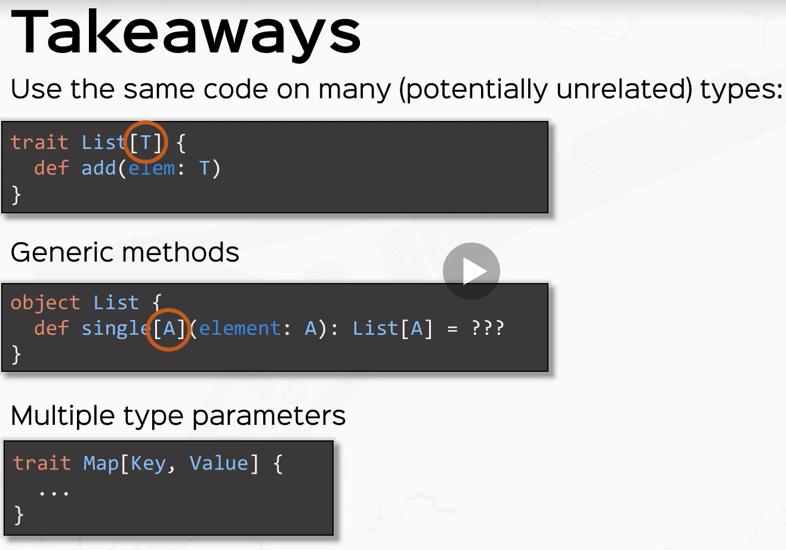

_Generic Class_:
A class that takes type parameters.  For example, because
`scala.List` takes a type parameter it is a generic class

_Generic Trait_:
A trait that takes type parameters.  For example, because
`scala.Set` takes a type parameter it is a generic trait

_Type Parameter_:
A parameter to a generic class or generic method that must
be filled in by a type.  For example `List` is defined as

```scala
class List[T] { ... }
```

and `identity` is defined as

```scala
def identity[T](x:T) = x
```

The `T` in both cases is a type parameter

