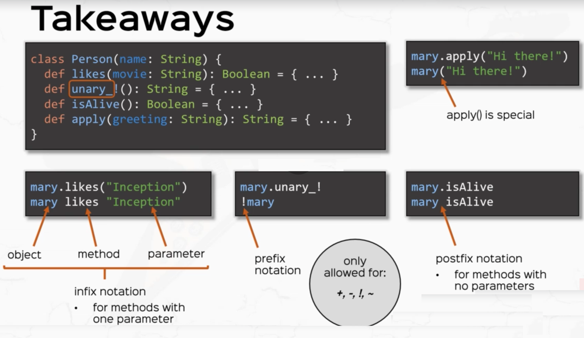

`myObject myMethod 1` is the same as calling `myObject.myMethod(1)`

Operator (i.e. function) names can be alphanumeric, symbolic (e.g. `x1`, `*`, `+?%&`, `vector_++`, `counter_=`)
    
The precedence of an operator is determined by its first character, with the following increasing order of priority:

    (all letters)
    |
    ^
    &
    < >
    = !
    :
    + -
    * / %
    (all other special characters)
   
The associativity of an operator is determined by its last character: Right-associative if ending with `:`, Left-associative otherwise.
   
Note that assignment operators have lowest precedence. (Read Scala Language Specification 2.9 sections 6.12.3, 6.12.4 for more info)

## Defining your own Operators:

* Methods with one parameter can be called with `infix` notation
```scala
 def likes(movie: String): Boolean = movie == favoriteMovie
 mary likes "Inception"
```

* Methods unary functions (e.g. have one operand) can be called with `prefix` notation
```scala
  def unary_! : String = s"$name, what the heck?!?"
  !mary
```

* Methods zero parameter functions can be called with `postfix` notation
```scala
  def isAlive: Boolean = true
  mary isAlive
```

* Apply functions allow objects to be called like functions

```scala
 // the apply function
  def apply(): String = s"Hi, my name is $name and I like $favoriteMovie"
  mary() // will call the apply function
```


