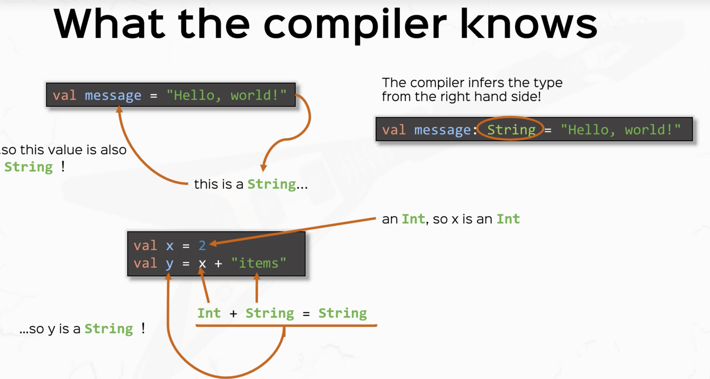

# Type Inference

## For Values

```scala
val <idetifier> [: <type>] = <data>
```

Note that specifying the type in a value definition is optional.  In situations where
it is possible to deduce the type of the value based on its assignment e.g.

```scala
val x = 10
``` 

you can leave of the explicit type from its assignment, this process is know as *type 
inference*

Values defined without a type are not typeless; they are assigned the proper type 
automatically by the compiler.


 

## For Functions

For most functions it is also optional to explicitly specify a type.  However, you must
specify the type for recursive functions.

  
 
