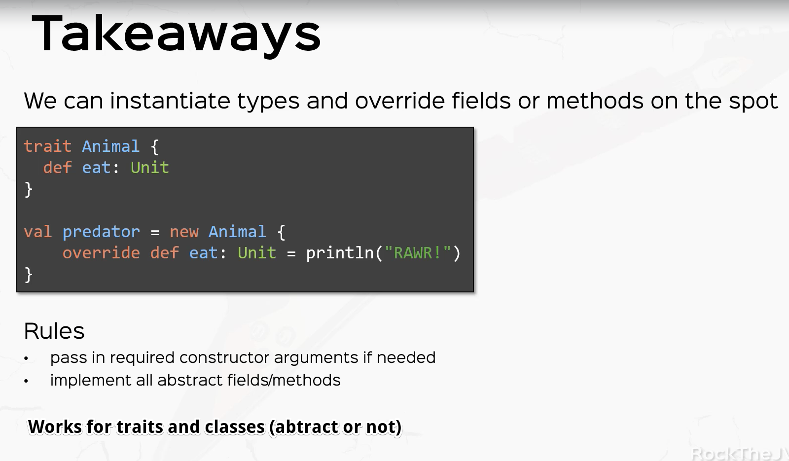

# Anonymous Classes

An anonymous class is a synthetic subsclass generated by the Scala compiler from a new expression
in which the class or trait name is followed by curly braces.  The curly braces contains the body
of the anonymous subclass, which may be empty.  However, if the name following refers to a trait or
class that contains abstract members, these must be made concrete inside the curly braces that define
the body of the anonymous subsclass.

```scala
trait RationalTrait {
  val numerArg: Int
  val denomArg: Int
} 

val anonymousClass = new RationalTrait {
    val numerArg = 1
    val denomArg = 2
}
```




# Lambda Expressions and "SAM" types

In Java 8, a lambda expression can be used anywhere an instance of a class or interface that contains a single
abstract method (SAM) is required.

```scala

// This trait (could also be an abstract class) has a single abstract method
trait HasGrade {
  def getGrade(): String
}

//  this function literal can be used anywhere an instance of HasGrade it required
val reportGrade = () => "A"
``` 
