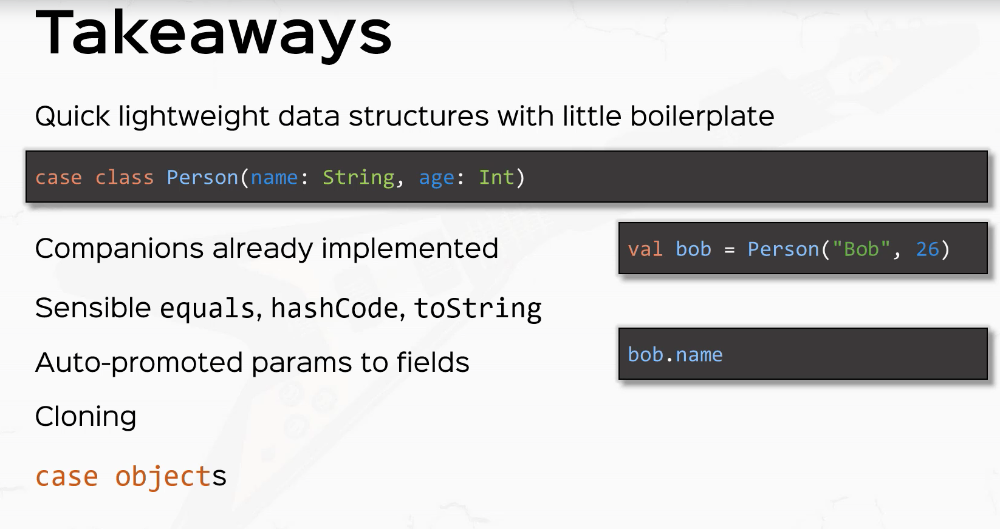

#Case Classes

## Case Classes are regular classes with some "Free Stuff"
___________________
* apply
* unapply
* accessor methods are created for class parameter
* copy
* equals and hashCode
* toString
___________________

## Description
```scala
case class Person(name: String, age: Int)
```

Classes defined with the `case` modifier are called _case classes._  Using the modifier cases
the Scala compiler add some syntactic sugar to the class.

* It creates a `companion object` with a factory method to create a case class without requiring the `new` keyword.
  Under the covers the _apply_ method is called.

```scala
case class Person(name: String, age: Int)
val p = Person("ryan", 21)  //instead of val p = new Person("ryan", 21)
```

* Since case classes have an unapply method you can use them in [pattern matching](./Pattern-Matching.md). This is one of
 the biggest advantages of case classes.

```scala

p match {
  case Person(name, age) =>  println(s"$name and $age extracted!")
}
```

* In case classes the class parameters are promoted to class fields

```scala
case class Person(name: String, age: Int)
val p = Person("ryan", 21)
println(p.name) //is allowed
```

* The compiler adds "natural" implementations of methods `toString`, `hashCode` and `equals`  these
methods will print, hash and compare a whole tree consisting of the class and (recursively) all its
arguments.

Since `==` in Scala always delegates to equals, this means that elements co case classes are always
compared structurally:

```scala
case class Person(name: String, age: Int)
val p1 = Person("bob", 19)
val p2 = Person("bob", 19)
val p3 = p1.copy()

// Here p1 == p2 == p3 is true
``` 

## Companion Class
A class that shares the same name with a singleton object defined in the same source file.  The
class is the singleton object's companion class

## Companion Object
A singleton object that shares the same name with a class defined in the same source file. Companion
objects and classes have access to each other's private members.  In addition, any implicit
conversions defined in the companion object will be in scope anywhere the class is used.

## Case Classes & Companion Objects
Case classes have automatically generated companion objects


