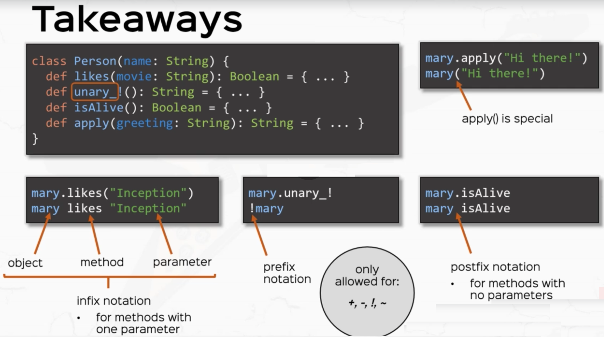

# Operators

## Examples of Scala Operations

```scala
1 > 0                   true                greater than (a comparison operation)
1 == 0                  false               equals to (another comparision operation)
1.max(0)                1                   max operation returns the greater value between the left and right argument
-5.abs                  5                   absolute value operation
"Hello, " + "world!"    "Hello, world!"     concatentation operation
"#" * 3                 "###"               times operation
"Alice".toUpperCase     "ALICE"             to upper case operation
true && true            true                logical and operation with infix notation
true.&&(true)           true                logical and operator with dot notatation
```

## Cheat Sheet

* Infix notation `x _op_ y` is `x.op(y)`
* Postfix notation `x op` is `x.op()`
* Only + - ! ~ can be Prefix operators  define method unary_op
* Right associativity if the _last_ character is a colon :
* `x(i) = x(j)` is `x.update(i, x.apply(j))`
* There is no `++` or `--` for numbers.  Use `x += 1` and `y -= 1`
* Use `x == y` to compare object -- it calls `equals`

## Methods as operators

`myObject myMethod 1` is the same as calling `myObject.myMethod(1)`

Operator (i.e. function) names can be alphanumeric, symbolic (e.g. `x1`, `*`, `+?%&`, `vector_++`, `counter_=`)

## Arithmetic Operators

* Arithmetic operators have the same _precedence_ as in mathematics.  The following expressions are equivalent:

```scala
1 + 2 * 3
1.+(2.*(3))
```

* The result of arithmetic operations has the type of the widest operand:
```scala

1 + 2     // Int
1 + 2.0   // Double
```

## Operator Precedence in General
    
The precedence of an operator is determined by its first character, with the following increasing order of priority:

    Assigment Operations (lowest priority)
    Non-operator characters (all letters)
    |
    ^
    &
    = !
    < >
    :
    + -
    * / %
    All other special characters (highest priority)

## Operation Associativity
   
The associativity of an operator is determined by its last character: Right-associative if ending with `:`, Left-associative otherwise.
   
Note that assignment operators have lowest precedence. (Read Scala Language Specification 2.9 sections 6.12.3, 6.12.4 for more info)

## Defining your own Operators:

* Methods with one parameter can be called with `infix` notation
```scala
 def likes(movie: String): Boolean = movie == favoriteMovie
 mary likes "Inception"
```

* Methods unary functions (e.g. have one operand) can be called with `prefix` notation
```scala
  def unary_! : String = s"$name, what the heck?!?"
  !mary
```

* Methods zero parameter functions can be called with `postfix` notation
```scala
  def isAlive: Boolean = true
  mary isAlive
```

* Apply functions allow objects to be called like functions

```scala
 // the apply function
  def apply(): String = s"Hi, my name is $name and I like $favoriteMovie"
  mary() // will call the apply function
```


