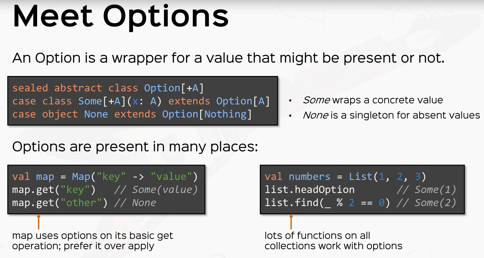
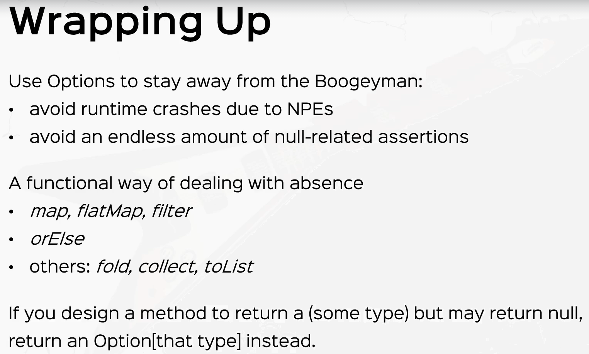

## Options




Scala has a standard type named `Option` for optional values.  Such a value can be of two forms: `Some(x)`, where
`x` is the actual value, or the `None` object which represents a missing value.

Optional values are produced by some standard operations on Scala's collections.  For instance, the `get` method of
Scala's `Map` produces `Some(value)` if a value corresponding to a given key has been found, or `None` if the given
key is not defined in the `Map`.

```scala
val capitals = Map("France" -> "Paris", "Japan" -> "Tokoyo")
val c1 = capitals get "France"   // c1 will be Some("Paris")
val c2 = capitals get "USA"      // c2 will be None
```

The most common way to take optional values apart is through a `getOrElse`  For instance:

```scala
def showCapital(c: Option[String]) = c.getOrElse("?")
val capitals = Map("France" -> "Paris", "Japan" -> "Tokoyo")
val c1 = showCapital(capitals get "Japan")   // c1 will be "Paris"
val c2 = showCaptial(capitals get "USA")      // c2 will be "?"
```

The `Option` type is used frequently in Scala programs. Compare this to the dominant idiom in Java of
using `null` to indicate no value. For example, the `get` method of `java.util.HashMapreturns` either a value
stored in the HashMap or `null` if no value was found. This approach works for Java but is error prone
because it is difficult in practice to keep track of which variables in a program are allowed to be `null`.
If a variable is allowed to be` null`, then you must remember to check it for `null` every time you use it.
When you forget to check, you open the possibility that a `NullPointerException` may result at *runtime*.
Because such exceptions may not happen very often, it can be difficult to discover the bug during
testing.

For Scala, the approach would not work at all because it is possible to store value types in Hash
Maps, and `null` is not a legal element for a value type. For instance, a `HashMap[Int, Int]` cannot
return `null` to signify "no element."

By contrast, Scala encourages the use of `Option` to indicate an optional value. This approach to optional
values has several advantages over Java's. First, it is far more obvious to readers of code that a variable
whose type is `Option[String]` is an optional `String` than a variable of type `String`, which may sometimes
be null. But most importantly, that programming error described earlier of using a variable that may
be `null` without first checking it for `null` becomes a type error in Scala. If a variable is of
type `Option[String]` and you try to use it as a `String`, your Scala program will not compile.

## Options in for comprehensions

```scala
def makeInt(s: String): Option[Int] = {
  try {
    Some(s.trim.toInt)
  } catch {
    case e: Exception => None
  }
}

val result = for {
  x <- makeInt("1")
  y <- makeInt("error")
  z <- makeInt("3")
} yield x + y + z
result: Option[Int] = None
```

We see inside a [for comprehension](For-Comprehensions.md) Options will short-circle at the first None.  Recall this
is because of the way for comprehension are semantic sugar for maps, and flatMaps.

```scala
val result = for {
  x <- makeInt("1")
  y <- makeInt("error")
  z <- makeInt("3")
} yield x + y + z

// is equivalent to

val result = makeInt("1").flatMap{ x => makeInt("error").flatMap{ y => { makeInt("3").map {z => x + y + z }}}}
```
This terminates on the makeInt("error").flatMap => None

