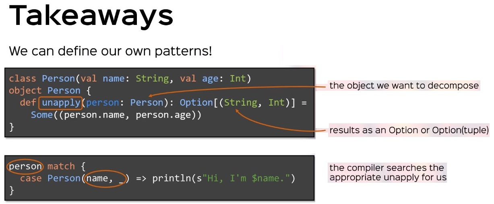
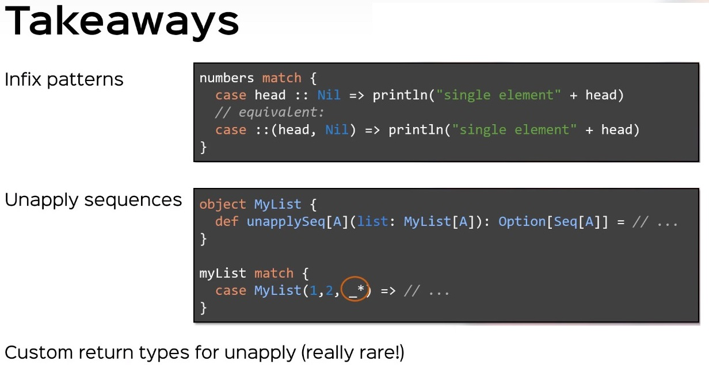

## Pattern matching

Pattern matching is used for decomposing data structures:

<!-- code -->
```scala
    unknownObject match {
      case MyClass(n) => ...
      case MyClass2(a, b) => ...
    }
```

Here are a few example patterns

<!-- code -->
```scala
    (someList: List[T]) match {
      case Nil => ...          // empty list
      case x :: Nil => ...     // list with only one element
      case List(x) => ...      // same as above
      case x :: xs => ...      // a list with at least one element. x is bound to the head,
                               // xs to the tail. xs could be Nil or some other list.
      case 1 :: 2 :: cs => ... // lists that starts with 1 and then 2
      case (x, y) :: ps => ... // a list where the head element is a pair
      case _ => ...            // default case if none of the above matches
    }
```

The last example shows that every pattern consists of sub-patterns: it
only matches lists with at least one element, where that element is a
pair. `x` and `y` are again patterns that could match only specific
types.

### Options

Pattern matching can also be used for `Option` values. Some
functions (like `Map.get`) return a value of type `Option[T]` which
is either a value of type `Some[T]` or the value `None`:
<!-- code -->
```scala
    val myMap = Map("a" -> 42, "b" -> 43)
    def getMapValue(s: String): String = {
      myMap get s match {
        case Some(nb) => "Value found: " + nb
        case None => "No value found"
      }
    }
    getMapValue("a")  // "Value found: 42"
    getMapValue("c")  // "No value found"
```

Most of the times when you write a pattern match on an option value,
the same expression can be written more concisely using combinator
methods of the `Option` class. For example, the function `getMapValue`
can be written as follows: 

<!-- code -->
```scala
    def getMapValue(s: String): String =
      myMap.get(s).map("Value found: " + _).getOrElse("No value found")
```

### Pattern Matching in Anonymous Functions

Pattern matches are also used quite often in anonymous functions:

<!-- code -->
```scala
    val pairs: List[(Char, Int)] = ('a', 2) :: ('b', 3) :: Nil
    val chars: List[Char] = pairs.map(p => p match {
      case (ch, num) => ch
    })
```

Instead of `p => p match { case ... }`, you can simply write `{case ...}`, so the above example becomes more concise:

<!-- code -->
```scala
    val chars: List[Char] = pairs map {
      case (ch, num) => ch
    }
```



### How does it all work?

Behind the scenes the Scala compiler looks for a special method called `unapply` to see if a match can be found.

#### If the unapply method  returns an Option[T] you have an extractor

<!-- code -->
```scala
  class Person(val name: String, val age: Int)

  object Person {
    def unapply(person: Person): Option[(String, Int)] = Option(person).map{p => (p.name, p.age)}
  }

  val bob = new Person("Bob", 25)
  val greeting = bob match {
    case Person(n, a) => s"Hi, my name is $n and I'm $a years old."
  }
  
  "Hi, my name is Bob and I'm 25 years old" is printed
```

Here in the pattern match above, the compiler sees there exists a method called `unapply` in the `Person` *object*, that takes a person intance and optionally returns a tuple
of (Int, String).  Person.unapply(bob) = Some("Bob", 25).  Since the Option is not empty the "pattern" is matched.  And n is given the value "Bob" and a is given the value 25.

#### If the unapply method returns an Boolean, then your unapply just tests true vs false

<!-- code -->
```scala
  class Person(val name: String, val age: Int)

  object Person {
    def unapply(person: Person): Option[(String, Int)] = Option(person).map{p => (p.name, p.age)}
  }
  
  object LegalPerson {
    def unapply(person: Person): Boolean = person.age > 21
  }

  val bob = new Person("Bob", 25)
  val greeting = bob match {
    case LegalPerson() => "They are legal"
    case Person(n, a) => s"Hi, my name is $n and I'm $a years old."
  }
  
  "They are legal" is printed
```

Here in the pattern match above, the compiler sees there exists a method called `unapply` in the `LegalPerson` *object*, that takes a person intance and returns boolean.  LegalPerson.unapply(bob) = True.  Since the boolean is true the "pattern" is matched.

#### But actually you can destructure (i.e. pattern) match via an object that has a get() and isEmpty() method

```scala
  abstract class Wrapper[T] {
    def isEmpty: Boolean
    def get: T
  }


  class Person(val name: String, val age: Int)

  object PeronWrapper {
    def unapply(person: Person): Wrapper[String] = new Wrapper[String] {
      def isEmpty = false

      def get: String = person.name
    }
  }

  val bob = new Person("Bob", age = 51)

  val whatHappened: String = bob match {
    case PeronWrapper(n) => s"wow $n it worked!"
  }
  ```




