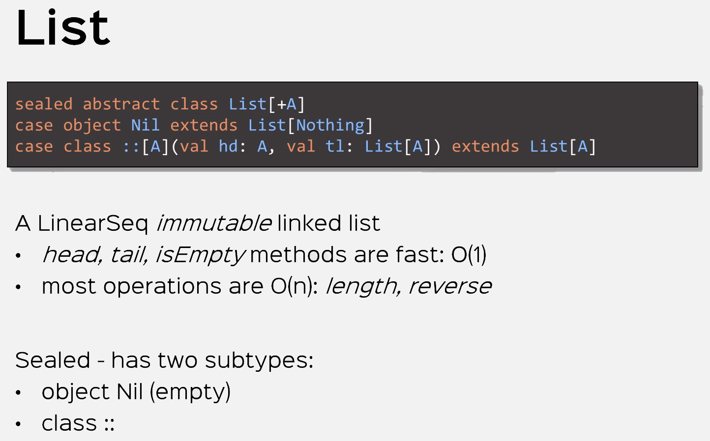
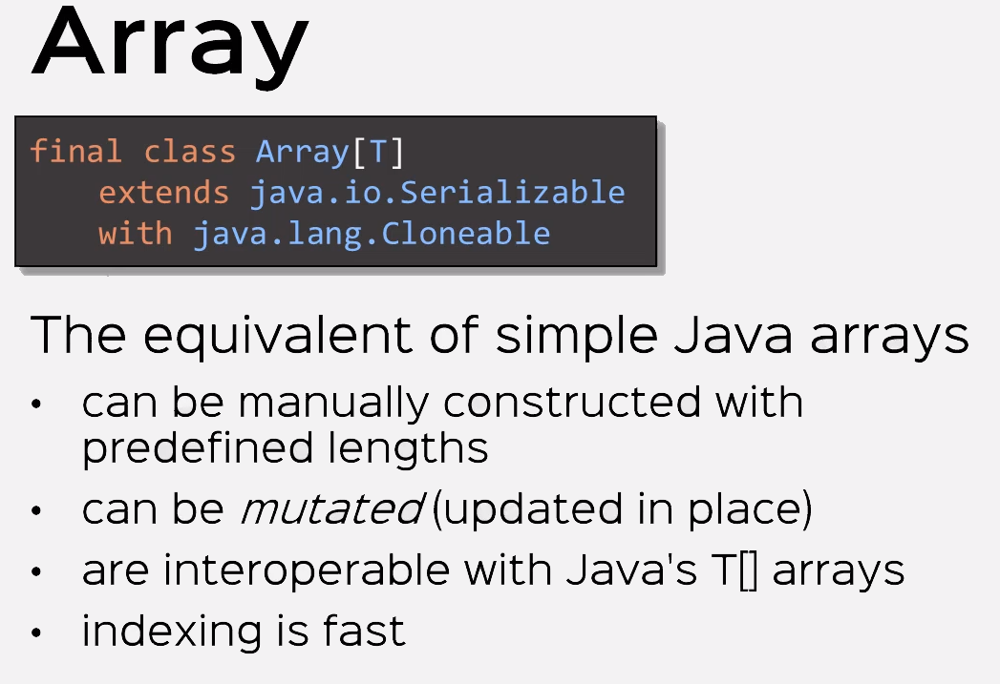

## The Sequence Traits:  Seq, IndexedSeq, and LinearSeq

The `Seq` trait represents sequences. A sequence is a kind of iterable that has a length and whose
elements have fixed index positions, starting from `0`.

### Summary of Operations on sequences.

#### Indexing and Length Operations:
`apply`, `isDefinedAt`, `length`, `indices`, and `lengthCompare` for a `Seq`, the apply operation means indexing;
hence a sequence of type Seq[T] is a partial function that takes an Int argument (an index) and yields a sequence
element of type T.

In other words Seq[T] extends PartialFunction[Int, T]. The elements of a sequence are indexed from zero up to the
length of the sequence minus one. The `length` method on sequences is an alias of the size method of general
collections. The `lengthCompare` method allows you to compare the lengths of two sequences even if one of the sequences
has infinite length.

#### Index Search Operations:
`indexOf`, `lastIndexOf`, `indexOfSlice`, `lastIndexOfSlice`, `indexWhere`, `lastIndexWhere`, `segmentLength`, and
`prefixLength`, which return the index of an element equal to a given value or matching some predicate.

#### Addition operations:
`+:`, `:+`, and `padTo`, which return new sequences obtained by adding elements at the front or the end of a sequence.

#### Update operations:
`updated` and `patch`, which return a new sequence obtained by replacing some elements of the original sequence.

#### Sorting operations:
`sorted`, `sortWith`, and `sortBy`, which sort sequence elements according to various criteria.

#### Reversal operations:
`reverse`, `reverseIterator`, and `reverseMap`, which yield or process sequence elements in reverse order, from last to
first.

#### Comparison operations:
`startsWith`, `endsWith`, `contains`, `corresponds`, and `containsSlice`, which relate two sequences or search an
element in a sequence.

#### Multiset operations:
`intersect`, `diff`, `union`, and `distinct`, which perform set-like operations on the elements of two sequences or remove
duplicates.

### A Note on update and updated:
If a sequence is mutable, it offers in addition a side-effecting `update` method, which lets sequence elements be
updated. Recall that syntax like `seq(idx) = elem` is just a shorthand for seq.update(idx, elem). Note the difference
between `update` and `updated`. The `update` method changes a sequence element in place, and is only available for
mutable sequences. The updated method is available for all sequences and always returns a new sequence instead of
modifying the original.


### Examples
<!-- code -->
```scala

// Indexing and length:
xs(i) // (or, written out, xs apply i) The element of xs at index i.
xs isDefinedAt i // Tests whether i is contained in xs.indices.
xs.length //The length of the sequence (same as size).
xs.lengthCompare ys  //Returns -1 if xs is shorter than ys, +1 if it is longer, and 0 is they have the same length.
  // Works even if one of the sequences is infinite.
xs.indices //The index range of xs, extending from 0 to xs.length - 1.

// Index search:
xs indexOf x //The index of the first element in xs equal to x (several variants exist).
xs lastIndexOf x //The index of the last element in xs equal to x (several variants exist).
xs indexOfSlice ys //The first index of xs such that successive elements starting from that index form the sequence ys.
xs lastIndexOfSlice ys //The last index of xs such that successive elements starting from that index form the sequence ys.
xs indexWhere p //The index of the first element in xs that satisfies p (several variants exist).
xs segmentLength (p, i) //The length of the longest uninterrupted segment of elements in xs, starting with xs(i),
                        // that all satisfy the predicate p.
xs prefixLength p  //The length of the longest prefix of elements in xs that all satisfy the predicate p.

// Additions:
x +: xs //A new sequence consisting of x prepended to xs.
xs :+ x //A new sequence that consists of x append to xs.
xs padTo (len, x) //The sequence resulting from appending the value x to xs until length len is reached.

// Updates:
xs patch (i, ys, r) //The sequence resulting from replacing r elements of xs starting with i by the patch ys.
xs updated (i, x)  //A copy of xs with the element at index i replaced by x.
xs(i) = x  //Or, written out, xs.update(i, x), only available for mutable Seqs. Changes the element of xs at index i to y.

// Sorting:
xs.sorted // A new sequence obtained by sorting the elements of xs using the standard ordering of the element type of xs.
xs sortWith lessThan //A new sequence obtained by sorting the elements of xs, using lessThan as comparison operation.
xs sortBy f //A new sequence obtained by sorting the elements of xs. Comparison between two elements proceeds by mapping
            // the function f over both and comparing the results.
// Reversals:
xs.reverse //A sequence with the elements of xs in reverse order.
xs.reverseIterator //An iterator yielding all the elements of xs in reverse order.
xs reverseMap f //A sequence obtained by mapping f over the elements of xs in reverse order.

// Comparisons:
xs startsWith ys //Tests whether xs starts with sequence ys (several variants exist).
xs endsWith ys //Tests whether xs ends with sequence ys (several variants exist).
xs contains x //Tests whether xs has an element equal to x.
xs containsSlice ys //Tests whether xs has a contiguous subsequence equal to ys.
(xs corresponds ys)(p) //Tests whether corresponding elements of xs and ys satisfy the binary predicate p.

// Multiset operations:
xs intersect ys //The multi-set intersection of sequences xs and ys that preserves the order of elements in xs.
xs diff ys  //The multi-set difference of sequences xs and ys that preserves the order of elements in xs.
xs union ys //Multiset union; same as xs ++ ys
xs.distinct //A subsequence of xs that contains no duplicated element.
```

## Subtypes
Each (immutable & mutable) `Seq` trait has two subtraits, `LinearSeq` and `IndexedSeq`. These do not add any new
operations, but each offers different performance characteristics. A linear sequence has efficient `head` and `tail`
operations, whereas an indexed sequence has efficient `apply`, `length`, and (if
mutable) `update` operations.

`List` is a frequently used linear sequence, as is `Stream`. Two frequently used indexed sequences are `Array` and 
`ArrayBuffer`. The `Vector` class provides an interesting compromise between indexed and linear access. It has both
effectively constant time indexing overhead and constant time linear access overhead. Because of this, vectors are a
good foundation for mixed access patterns where both indexed and linear accesses are used.



