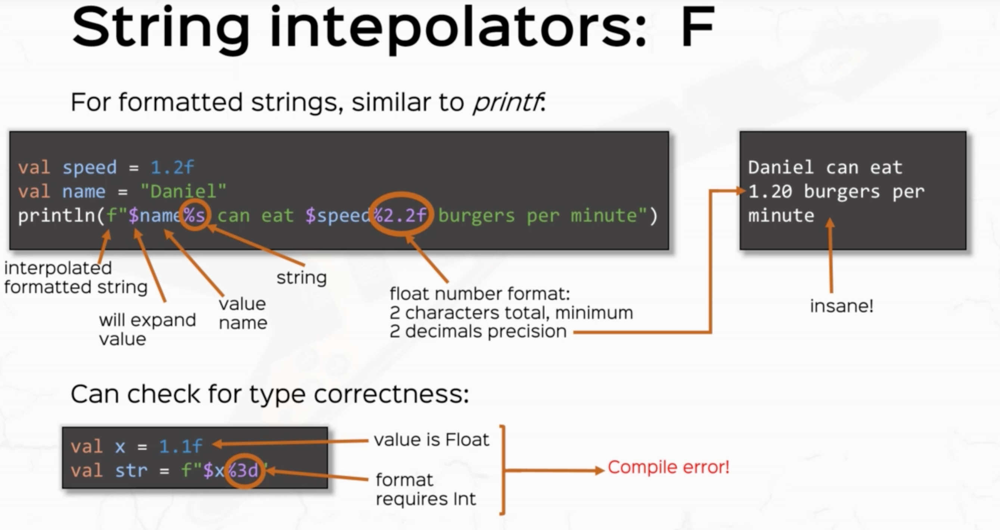

# String Interpolation

String interpolation (or variable interpolation, variable substitution, or variable expansion) is
 the process of evaluating a string literal containing one or more placeholders, yielding a
 result in which the placeholders are replaced by their corresponding values. It is a form of
 simple template processing or, in formal terms, a form of quasi-quotation (or logic substitution
  interpretation). String interpolation allows easier and more intuitive string formatting and
  content-specification compared with string concatenation.  [More](https://en.wikipedia.org/wiki/String_interpolation)
  
 ## String Interpolation in Popular Languages
  
 ```javascript
// JavaScript
const appleCount = 4;
console.log(`I have ${appleCount} apples`);
``` 

```kotlin
// Kotlin
val appleCount = 4;
println("I have $appleCount apples")
```

```swift
// swift
let appleCount = 4
print("I have \(appleCount) apples")
```

## String Interpolation in Scala

```scala
// Scala
val appleCount = 4
println(s"I have $appleCount apples") 
```

So far so good, this looks pretty standard!  However, Scala provides
[multiple string interpolators](https://docs.scala-lang.org/overviews/core/string-interpolation.html),
`s, f, raw, """` and easily allows you to write custom interpolators!



```scala

/* Custom Interpolator
  Here we define custom string interpolator `date` so that you can define a
  java.time.LocalDate as data"$year-$month-$day"
*/

implicit class DateInterpolator(val sc: StringContext) extends AnyVal {
  def date(args: Any*): LocalDate = LocalDate.of(
    args(0).toString.toInt,
    args(1).toString.toInt,
    args(2).toString.toInt
  )
}

val year = 2020
val month = 9
val day = 22

val fancyDate: LocalDate = date"$year-$month-$day"

```

