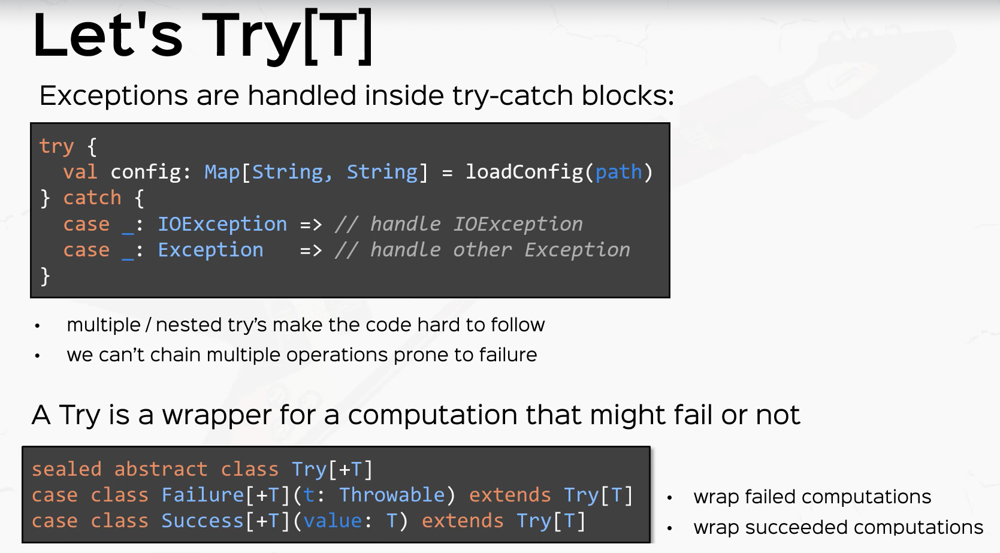
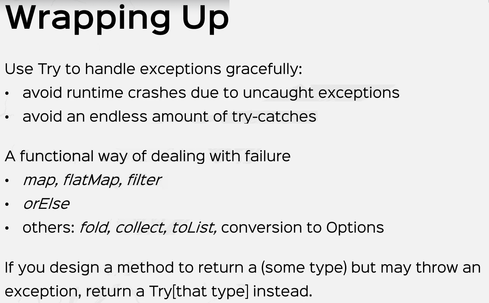

# Using Try, Success, and Failure

The Scala `scala.util.Try` as an approach similar to `Option`, but returns failure information rather
than a `None`.

The result of a computation wrapped in a `Try` will be one of its subclasses: `Success` or `Failure`.
If the computation succeeds, a `Success` instance is returned; if an exception was thrown, a `Failure`
will be returned, and the `Failure` will contain the exception which was thrown.




Example:

```scala
import scala.util.{Try, Success, Failure}

def divideXByY(x: Int, y: Int): Try[Int] = Try(x/y)

val result = divideXByY(1,0)

result match {
  case Success(v) => println(s"The answer is v")
  case Failure(e) => println(s"Error: ${e.getMessage}")
}
```

Since Try supports `map`, `flatMap` and `filter` you can do composition in the usual way:

```scala
import scala.util.{Try, Success, Failure}

val success1: Try[Int] = Success(10)
val success2: Try[Int] = Success(20)
val fail1: Try[Int] = Failure(new Exception("No Dice!"))

val r1 = for {
  v1 <- success1
  v2 <- success2
} yield v1 + v2

// r1 => type Try[Int]  value Success(30)

val r2 = for {
  v1 <- success1
  v2 <- fail1
} yield v1 + v2

// r1 => type Try[Int]  value Failure(new Exception("No Dice!"))
```

## Try as a Collection

The `scala.util.Try` collection turns error handling into collection management. It
provides a mechanism to catch errors that occur in a given function parameter, returning
either the error, or the value returned by applying the function.

Scala provides the ability to raise errors by throwing _exceptions_, error types that may
include a message, or a stack trace, or other information.  Throwing an exception in your
Scala code will disrupt the flow of your program and return control to the closet handler
for that particular exception.  Unhandled exceptions will terminate the application, although
most Scala application [frameworks](index.md#Frameworks) and web containers take care to prevent this.

### Throwing Exceptions
Exceptions may be thrown by your code, by library methods that you invoke, or by the Java Virtual Machine
(JVM).  For example yhe JVM will throw a `java.util.NoSuchElementException` if you call `None.get` or
`Nil.head`  (the head of an empty list), or a `java.lang.NullPointerException` if you access a field
or method of a `nill` value.

To throw an exception, use the `throw` keyword with a new `Exception` instance.  The text message provided
to `Exception` is optional:

```scala
throw new Exception("No DB connection, exiting...")
``` 

### Handling (catching) Exceptions

The complement to throwing exceptions is catching and handling them.  Scala _does_ support `try {} .. catch` blocks,
where the catch block contains a series of `case` statements that attempt to match the thrown error.  I recommend
using the `scala.util.Try()`  exclusively because it offers a safer, more expressive, and fully monadic
approach to handling errors.

Since `Try` and its subtypes are also monadiac collections, you can expect to find a number of thrilling and 
yet familiar methods for error handling.  You may find that selecting the right error handling approach (including
whether to handle them at all!) for your application will depend on the requirements and context.


