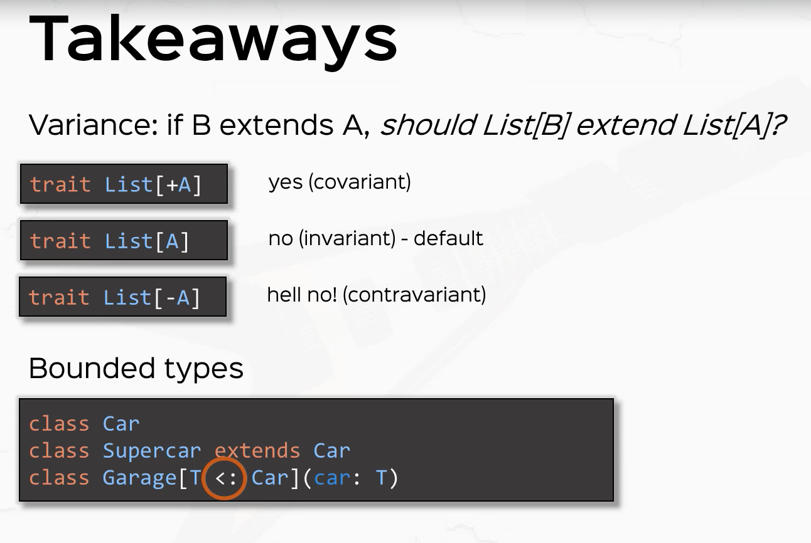

# Variance in parametrized types

Given `A <: B`  (i.e. A is a subtype of B)

* If `C[A] <: C[B]`, `C` is called _covariant_
* If `C[A] >: C[B]`, `C` is called _contravariant_
* Otherwise if there is no subtype relationship between `C[A]` and `C[B]` `C` is called _invariant_

<!-- code -->
```scala
   class C[+A] { ... } // Is how we define C to be covariant
   class C[-A] { ... } // Is how we define C to be contravariant
   class C[A]  { ... } // Is how we define C to be invariant.  Notice this is the default
```

Examples:
1. Should `List[T]` be covariant or contravariant?
Well given `Cat <: Animal` should I be able to use a `List[Cat]` anywhere a `List[Animal]` is used?  Yes, that makes
sense intuitively, and it turns out to be correct.

This means `List[Cat] <: List[Animal]`.  So `List[T]` follows with subtype arrangement of `T`.  Therefore `List` is
covariant.

2. Ok should `Array[T]` also be covariant?
Turns out *no*!  Why?  Well arrays are mutable, so if Array[T] *was* covariant you could do:

<!-- code -->
```scala
   val bobCat = Array[Cat](cat1, cat2, cat3)
   val sally: Array[Any] = bobCat
   sally(0) = "string"  //now we have just added a "string" val to our list of cats! Bad!
```
So for `Arrays` we need to make them `invariant`.

3. So in general *mutable* containers are `invariant` and *immutable* containers are `covariant`


# Variance for function parameters and return types
Let's consider variance of function types with respect to their parameters and return types.

If `P1 <: P2` and `R1 <: R2`, then should `P1 => R1 <: P2 => R2` be true?
Nope!  Here is why, say:
* `f1 = Cat => Car`
* `f2 = Animal => Vehicle`

So is `Cat => Car :< Animal => Vehicle`?  Well if it *was* then I could use `f1` anywhere I use `f2`.  But I can't replace f2(animal) with f1(animal).  Therefore  `Cat => Car <: Animal => Vehicle` is out!


Ok what about If `P1 <: P2` and `R1 <: R2`, then should `P2 => R1 <: P1 => R2` be true?
Yes!  
* `f1 = Animal => Car`
* `f2 = Cat => Vehicle`

Can I use f1, anywhere f2 was used?  Yes!  f2 takes an `Cat` and returns a `Vehicle`.  Does this work for f1?  Yep
a call f2(cat) can be replaced with f1(cat).  f1(cat) returns a car.  That matches the expected type for f1!     

Therefore `Functions` must be contravariant in their *argument* types and covariant in their *result* types, e.g.

# Summary

<!-- code -->
```scala
  class Seq[+T] //Lists etc. are covariant, and can be because they are immutable

  class Array[+T] {
    def update(x: T): Unit
  } // variance checks fails

 trait Function1[-T, +U] {
    def apply(x: T): U
  } // Variance check is OK because T is contravariant and U is covariant
```

Find out more about variance in
[lecture 4.4](https://class.coursera.org/progfun-2012-001/lecture/81)
and [lecture 4.5](https://class.coursera.org/progfun-2012-001/lecture/83)


